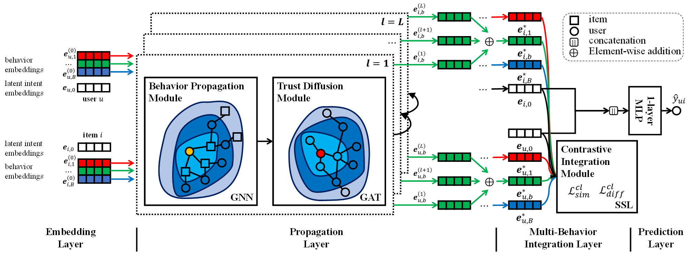

# MB-Soc

This Is the Official PyTorch Implementation for Our Paper:

>Multi-Behavior Enhanced Graph Neural Networks for Social Recommendation. PRCV 2023.

## Overview

We propose **MB-Soc**, a multi-behavior enhanced heterogeneous graph neural network for social recommendation.



## Package

* torch==1.11.0
* numpy==1.22.3 
* pandas==1.4.1
* tqdm==4.65.0

## Usage

1.Preprocess: Choose the dataset to complete the preprocessing process.
```
python preprocess.py --dataset Ciao --test_rate 0.1
```
2.Pre-train the model on the different single behavior graph.
```
python pre_training.py --pre_lr 5e-3
```
3.Fine-tune the model on the overall interaction graph.
```
python fine_tuning.py --lr 1e-4 --batch 64 --layers 2
```

## Appendix

MB-Soc-Supp.pdf is the **Appendix** of our paper.